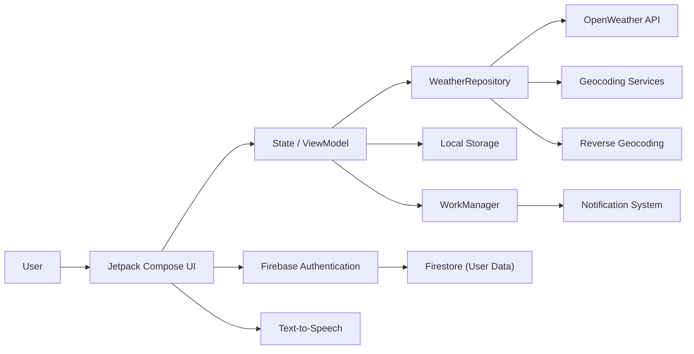

  

<h1 align="center">🌤️ Weather Buddies</h1>

---

## Disclaimer
This is a **student assignment project** for the **Kotlin App Development** module at **Ngee Ann Polytechnic**.  
Developed strictly for **educational purposes only**.

---

## Team Members
| Name | Student ID | GitHub Username |
|------|------------|----------------|
| Phua Yong Xiang | S10258483F | Pyongxiang |
| Evan Goh | S10258381G | evangohh |
| Chang Zhi Heng | S10241579H | Heng-Github1 |
| Keagan Tan | _(add)_ | GITNumberx |

---

## Application Overview
**Weather Buddies** is a mobile weather application that allows users to check **real-time weather conditions**, **location-based forecasts**, and **weather alerts**.  
In addition to weather information, the app supports **social interaction features**, enabling users to communicate and share weather experiences with friends.

---

## Current State of Deployment
- Platform: **Android (Kotlin + Jetpack Compose)**
- Status: **Functional prototype**
- Deployment: **Local build / Emulator**
- APIs & Services:
  - OpenWeather API
  - Google Maps SDK (Compose)
  - Firebase Authentication
  - Firebase Firestore

---

## Motivation & Objectives
The objective of Weather Buddies is to make weather checking more **engaging, practical, and social**.  
Instead of relying solely on generic forecasts, users can view **location-specific weather**, receive **background alerts**, and share real-time conditions within their social groups.

---

## Use of Generative AI Tools
- **ChatGPT** and **Gemini LLMs** were used as development assistance tools
- Used for:
  - Debugging Kotlin and Jetpack Compose issues
  - Understanding Android APIs and workflows
  - Improving code structure and documentation
- All generated outputs were reviewed and adapted by the team

---

## Stage 1 – Features & Task Allocation
| Feature | Team Member |
|--------|------------|
| Login Page | Phua Yong Xiang |
| Current Weather Display | Chang Zhi Heng |
| “Use My Location” Function | Evan Goh |
| Forecast Screen | Keagan Tan |

Stage 1 focused on implementing **core functionality**, navigation, and API integration.

---

## Stage 2 – Enhanced & New Functionalities
- Cloud-synced favourite locations using Firestore
- Background weather alerts using WorkManager
- Improved location search with fallback handling
- Map-based weather search using Google Maps
- Weather detail widgets
- Notification permission handling (Android 13+)
- Social features added for communication
- Text-to-Speech weather narration
- UI and usability improvements
- Geocoding & reverse geocoding (place names ↔ coordinates)

---

## Individual Contributions (Stage 2)

### Evan Goh
- Location-based weather retrieval
- Location search and geocoding logic
- Forecast page integration
- Weather detail widgets
- Background notification alerts
- Notification permission handling
- Designed app icon

### Phua Yong Xiang
- Authentication flow improvements
- Stored preferences for “Remember Me”
- User account management
- Friends feature and friend search
- View favourite locations from friends
- 1-to-1 and group chat rooms
- UI and navigation refinements
- Designed app icon

### Chang Zhi Heng
- Implemented map-based weather search using Google Maps Compose
- Enabled place name and postal code search
- Added tap-to-select map interaction
- Integrated reverse geocoding
- Connected map selection to real-time weather retrieval
- Implemented saving locations to Firestore
- Ensured user-specific data storage
- Handled error states and API failures

### Keagan Tan
- Forecast feature implementation
- Forecast screen UI
- Navigation and testing support

---

## New Concepts Applied
- **Cloud NoSQL Database (Firestore)** – user-specific data persistence
- **Background Processing (WorkManager)** – reliable weather alerts
- **Modern Notification Handling** – channels and runtime permissions
- **Jetpack Compose** – reactive, state-driven UI
- **Text-to-Speech** – accessibility enhancement
- **Map SDK & Geocoding Services** – location-based interaction and search

---

## System Architecture Diagram

---
## Screenshots Of User Interface

    
 
    
 
    

